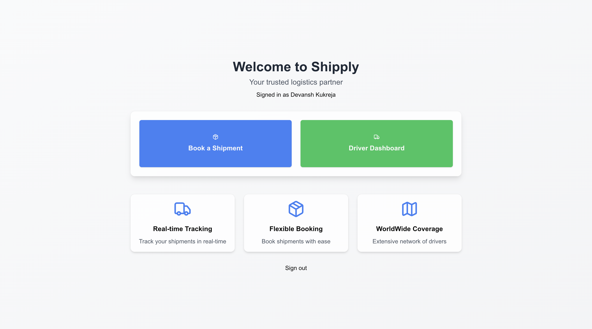

# Shipply: On-Demand Logistics Platform

An Logistic platform for moving goods, connecting users who need items transported with a fleet of drivers, offering real-time availability, pricing, and vehicle tracking.

## Table of Contents

- [Introduction](#introduction)
- [Features](#features)
- [Architecture](#architecture)
- [Entity-Relationship Diagram](#entity-relationship-diagram)
- [Technologies Used](#technologies-used)
- [Screenshots](#screenshots)
- [Installation](#installation)
- [Usage](#usage)

## Introduction

This on-demand logistics platform enables users to book transportation services for moving goods, similar to how Uber connects riders with drivers. Users can specify pickup and drop-off locations, select vehicle types, receive instant price estimates, and track their drivers in real-time. Drivers can accept bookings, update job statuses, and share their location.

The platform is designed to handle high traffic, supporting **10,000 concurrent requests per second**, **50 million registered users**, and **100,000 registered drivers** globally.

## **Demo Video**
**Loom**: https://www.loom.com/share/cece42907a4f41748a3369972665bd28?sid=7bd4e42c-a77b-4ead-abdc-4a08226d2364

## Features

### Users

- **Easy Booking Process**: Quickly book transportation by specifying pickup and drop-off locations.
- **Vehicle Selection**: Choose from various vehicle types based on the size and requirements of the goods.
- **Instant Price Estimates**: Receive upfront pricing based on distance, vehicle type, and current demand.
- **Real-Time Tracking**: Track drivers in real-time on an interactive map.
- **Booking History**: View past bookings and statuses.

### Drivers

- **Simple Registration**: Sign up by providing personal and vehicle details.
- **Booking Requests**: Receive and accept or reject booking requests in real-time.
- **Job Management**: Update job statuses (e.g., en route, collected, delivered).
- **Location Sharing**: Share real-time location with users.

### System

- **Scalable Architecture**: Designed to handle high traffic with load balancing and clustering.
- **Distributed Database**: Implements database sharding for efficient data management.
- **Real-Time Communication**: Uses Socket.IO and Redis for real-time updates.
- **Caching and Queues**: Redis caching and message queues for performance optimization.
- **Event Streaming**: Apache Kafka for handling high-throughput data streams.
- **Map Integration**: Interactive maps with Leaflet and OpenStreetMap.

## Architecture

The platform is built with scalability and performance in mind, utilizing a layered architecture that includes:

- **Clients**: Web and mobile applications for users and drivers.
- **Load Balancer**: Custom load balancer to distribute requests.
- **Backend Services**: API servers and real-time communication servers using Socket.IO.
- **Data Layer**: Sharded PostgreSQL databases managed via Prisma ORM.
- **Caching Layer**: Redis for caching and storing real-time data.
- **Messaging and Streaming**: Kafka and Redis queues for event streaming and background processing.
- **External Services**: Geocoding and mapping APIs, payment gateways.


## Entity-Relationship Diagram

The platform's database schema is designed to efficiently handle relationships between users, drivers, bookings, vehicles, payments, and tracking data.


## Technologies Used

- **Frontend Framework**: [Next.js](https://nextjs.org/) with TypeScript
- **Server-Side Rendering and Routing**: Next.js App Router
- **Database and ORM**: [PostgreSQL](https://www.postgresql.org/) with [Prisma](https://www.prisma.io/)
- **Authentication**: [NextAuth.js](https://next-auth.js.org/)
- **Real-Time Communication**: [Socket.IO](https://socket.io/)
- **Caching and Real-Time Data Store**: [Redis](https://redis.io/)
- **Map Rendering**: [Leaflet](https://leafletjs.com/)
- **Event Streaming Platform**: [Apache Kafka](https://kafka.apache.org/)
- **Load Balancing and Clustering**: Node.js Cluster Module, Custom Load Balancer with `http-proxy`
- **Message Queues**: Redis Queues
- **Infrastructure Management**: Node.js Clustering, Custom Scripts
- **Geocoding and Mapping APIs**: [OpenStreetMap](https://www.openstreetmap.org/) (via Leaflet)
- **Payment Processing**: (Placeholder for Payment Gateway, e.g., Stripe or PayPal)
- **Monitoring and Logging**: (Placeholder for tools like Prometheus, Grafana)

## Screenshots




## Installation

To run the platform locally, follow these steps:

### Prerequisites

- **Node.js** (version 14 or higher)
- **npm** or **yarn**
- **PostgreSQL** database
- **Redis** server
- **Kafka** cluster (optional for full functionality)
- **Git**

### Steps

1. **Clone the repository:**

   ```bash
   git clone https://github.com/devansh1401/Shipply.git
   cd Shipply

   ```

2. **Install dependencies:**

   ```bash
   npm install
   # or
   yarn install

   ```

3. Configure environment variables:

   Create a .env file in the root directory and add the following variables(see `.env.example`)

4. Run database migrations:

   ```bash
   npx prisma migrate dev

   ```

5. Start Redis server:

   ```bash
   redis-server

   ```

6. Start the Socket.IO server:

   ```bash
   node socket-server.js

   ```

7. Start the load balancer:

   ```bash
   node infrastructure/load-balancer.js

   ```

8. Start the application:
   ```bash
   npm run dev
   # or
   yarn dev
   ```

## Usage

Access the application:

Open your browser and navigate to http://localhost:3000.

**Sign up:**

Register as a user or driver to start booking rides or accepting jobs.

**Monitor and interact:**

Enjoy real-time updates and interact with the platform's features seamlessly.
